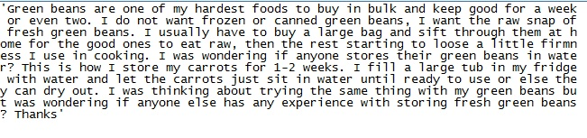
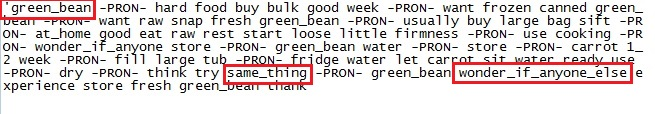

## Dataset

* cleaned  
  

---
  
## Natural Language Processing

### workflow
  1. text normalisation
    - cleaning, tokenization, stemming / lemmatization
  2. phrase modeling
  3. dictionary creation
  4. Latent Dirichlet Allocation

---  

## Natural Language Processing  

* processed  
  

* LDA
https://paultondata.github.io/vis/LDAthreads.html  
https://paultondata.github.io/vis/LDAusers.html

---

## Discussion / Future Work

 * authorship attribution
  - user meta-data  
 * troll detection  
 * deceptive opinion spam

---

## References

* Veggieboards:  
http://www.veggieboards.com
* Alexa page for Veggieboards:  
https://www.alexa.com/siteinfo/veggieboards.com
* Analyzing Internet Forums:  
http://psycnet.apa.org/record/2012-24262-002
* Modern NLP in Python:  
https://www.youtube.com/watch?v=6zm9NC9uRkk
https://github.com/skipgram/modern-nlp-in-python/tree/master/executable
* Improving LDA Topic Models:  
https://dl.acm.org/citation.cfm?id=2484166
* Authorship Attribution with LDA:  
http://aclweb.org/anthology/W11-0321
* Zipf's law:  
https://simple.wikipedia.org/wiki/Zipf%27s_law
